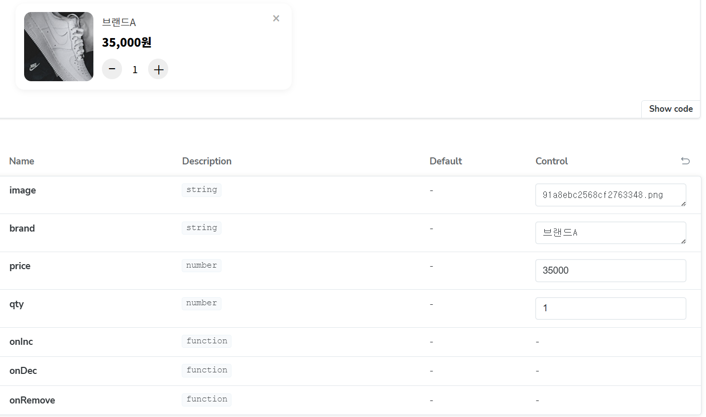

# 🛒 장바구니 프로젝트

## 프로젝트 개요
- **목표**: 사용자가 선택한 상품을 장바구니에 담아 결제 전 상품 수량 조정, 삭제, 총 금액 확인, 배송비 계산, 결제 진행이 가능하도록 구현
- **주요 기능**
  1. 장바구니 상품 목록 표시 (상품 이미지, 브랜드명, 상품명, 가격, 수량)
  2. 상품 수량 증가/감소, 삭제 기능
  3. 총 상품 금액 + 배송비 + 결제 금액 실시간 계산
  4. 뒤로가기 버튼을 통한 메인 페이지 이동
  5. 결제 페이지 이동 및 카드 등록·결제 기능
- **참여 팀원**
  - 송지우

---

## 개발 환경
- **프레임워크**: React 18
- **언어**: JavaScript (ES6+)
- **스타일링**: CSS Modules, Styled-components
- **기타 라이브러리**
  - Storybook (UI 컴포넌트 문서화)
  - React Router DOM (페이지 라우팅)
  - Context API (전역 상태 관리)
  - Jest, React Testing Library (유닛 테스트)

---

## 설치 및 실행 방법
```bash
# 패키지 설치
npm install

# 개발 서버 실행
npm start

# Storybook 실행
npm run storybook

# 테스트 실행
npm test
```
---

## 컴포넌트 구조
### 1. CartPage
- **역할**: 장바구니 화면 전체를 담당하는 메인 컨테이너.
- **주요 기능**:
  - 장바구니 목록 렌더링
  - 수량 증가(`inc`), 감소(`dec`), 상품 삭제(`removeItem`) 로직
  - 상품 금액(`subtotal`), 배송비(`shipping`), 총 금액(`total`) 계산
  - 결제 버튼 클릭 시 `onCheckout` 이벤트 실행
- **props**:
  - `cart` : 장바구니 상품 배열
  - `setCart` : 장바구니 상태 변경 함수
  - `onBack` : 뒤로가기 동작 함수
  - `onCheckout` : 결제 진행 함수
- **하위 컴포넌트**: `CartItem`


### 2. CartItem
- **역할**: 장바구니에 담긴 개별 상품을 표시하는 컴포넌트.
- **props**:
  - `image` : 상품 이미지
  - `brand` : 브랜드명
  - `price` : 상품 가격
  - `qty` : 수량
  - `onInc` : 수량 증가 핸들러
  - `onDec` : 수량 감소 핸들러
  - `onRemove` : 상품 삭제 핸들러


### 3. UI 내부 블록 (CartPage 내부)
- **상단 바 (Top Bar)**: 페이지 제목(`장바구니`) 표시, 필요 시 뒤로가기 버튼 추가 가능.
- **목록 영역 (List)**: `CartItem`들을 나열.
- **금액 요약 (Summary)**:
  - 상품 금액 표시
  - 배송비 표시
- **총 금액 박스 (TotalBox)**: 총 결제 금액 강조 표시.
- **결제 버튼 (PayBtn)**:
  - 장바구니가 비어 있으면 비활성화.
  - 클릭 시 결제 페이지로 이동 (`onCheckout` 실행).

---

## 테스트 방법

### 유닛 테스트 실행
npm test

### Storybook 실행
npm run storybook



---

## 유의사항 및 알려진 이슈
- 배송비 정책: 10만원 이상 결제 시 무료, 미만 시 3,000원 부과
- 금액 계산: 부동소수점 연산 이슈 방지를 위해 Math.floor() 또는 정수 변환 사용 권장

---

## 추가 항목
- React 공식 문서: https://react.dev/
- Storybook 공식 문서: https://storybook.js.org/
